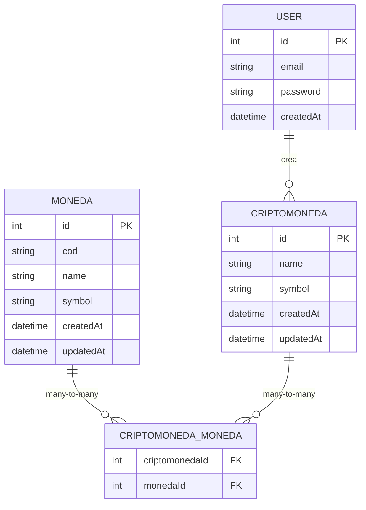

<p align="center">
  <!-- Aunque Markdown puro no centra, usar la etiqueta img con estilo es una práctica común para centrar elementos visuales como logos. La etiqueta p align="center" está obsoleta en HTML5, pero a veces se usa pragmáticamente en READMEs. La reemplazamos con style si es posible, o mantenemos p align si es para compatibilidad amplia -->
  <a href="http://nestjs.com/" target="_blank"></a>
</p>

<!-- Las referencias de enlaces/imágenes se definieron pero no se usaron en el código original. Es mejor usarlas si se definen, o simplemente usar enlaces directos como ya se hacía en los badges. He optado por mantener los enlaces directos para los badges, ya que es lo que tenías funcionando. -->
<!-- [circleci-image]: https://img.shields.io/circleci/build/github/nestjs/nest/master?token=abc123def456 -->
<!-- [circleci-url]: https://circleci.com/gh/nestjs/nest -->

<!-- Badges: Se quita la etiqueta <p> con align="center" que estaba obsoleta, se listan los badges directamente. La plataforma de git (GitHub/GitLab) suele renderizarlos bien así. Si quieres que estén centrados, tendrías que envolverlos en un div o p con estilo, pero la lista directa es más Markdown-friendly. Mantenemos el <p align="center"> para los badges porque es como lo tenías y es una práctica común para ese bloque. -->
<p align="center">
  <a href="https://www.npmjs.com/~nestjscore" target="_blank"></a>
  <a href="https://www.npmjs.com/~nestjscore" target="_blank"></a>
  <a href="https://www.npmjs.com/~nestjscore" target="_blank"></a>
  <!-- Usando enlace directo para CircleCI como en el original -->
  <a href="https://circleci.com/gh/nestjs/nest" target="_blank"></a>
  <a href="https://discord.gg/G7Qnnhy" target="_blank"></a>
  <a href="https://opencollective.com/nest#backer" target="_blank"></a>
  <a href="https://opencollective.com/nest#sponsor" target="_blank"></a> <!-- Badge actualizado si es el mismo link que Support us -->
  <a href="https://paypal.me/kamilmysliwiec" target="_blank"></a>
  <!-- Si este es un enlace diferente al de Sponsors, mantenlo. Si es el mismo, uno podría ser redundante. Mantengo ambos según tu original. -->
  <a href="https://opencollective.com/nest#sponsor"  target="_blank"></a>
  <a href="https://twitter.com/nestframework" target="_blank"></a>
</p>


<!-- Título principal del proyecto usando # (solo debe haber uno) -->
# API para Plataforma de Criptomonedas

API REST para gestión de monedas y criptomonedas con autenticación JWT y replicación histórica de datos.

<!-- Añadir un índice (Tabla de Contenidos) es una excelente práctica para READMEs largos -->
## 📖 Índice

- [✨ Características](#-características)
- [📦 Instalación](#-instalación)
- [🚀 Uso](#-uso)
- [🗄️ Diagrama de Base de Datos](#-diagrama-de-base-de-datos)
- [📚 Documentación Swagger](#-documentación-swagger)
- [🛠️ Tecnologías utilizadas](#-tecnologías-utilizadas)


<!-- Sección de Características (añadida para describir brevemente qué hace el proyecto) -->
## ✨ Características

*   Gestión completa de monedas y criptomonedas.
*   Sistema de autenticación de usuarios basado en JSON Web Tokens (JWT).
*   Implementación de CRUD con criptomonedas.
*   Base de datos PostgreSQL para persistencia.


<!-- Sección de Instalación -->
## 📦 Instalación

Sigue estos pasos para configurar y ejecutar el proyecto localmente:

```bash
# 1. Clonar el repositorio
git clone https://github.com/AdrC21/test_crypto_backend
cd test_crypto_backend

# 2. Instalar las dependencias
npm install

# 3. Configurar las variables de entorno
# Crea un archivo .env copiando el ejemplo:
cp .env.example .env
# Edita el archivo .env con tus configuraciones (ej. credenciales de BD)

# 4. Levantar el contenedor de PostgreSQL con Docker Compose
docker-compose up -d

# 6. Iniciar la aplicación en modo desarrollo
npm run start:dev
```

<!-- Sección de Uso o Ejemplos (renombrada para ser más estándar) -->
## 🚀 Uso

Aquí te mostramos algunos ejemplos básicos de cómo interactuar con los endpoints de la API utilizando `curl`. Reemplaza `[JWT_TOKEN]` con el token que obtendrás tras iniciar sesión.

```bash
# Registro de un nuevo usuario
curl -X POST http://localhost:3000/auth/register \
  -H "Content-Type: application/json" \
  -d '{"email": "user@example.com", "password": "password123"}'

# Inicio de sesión para obtener un token JWT
curl -X POST http://localhost:3000/auth/login \
  -H "Content-Type: application/json" \
  -d '{"email": "user@example.com", "password": "password123"}'

# Listar todas las monedas disponibles (requiere autenticación)
curl -X GET http://localhost:3000/moneda \
  -H "Authorization: Bearer [JWT_TOKEN]"

# Crear una nueva moneda (requiere autenticación)
curl -X POST http://localhost:3000/moneda \
  -H "Authorization: Bearer [JWT_TOKEN]" \
  -H "Content-Type: application/json" \
  -d '{"cod": "USD", "name": "Dólar Estadounidense", "symbol": "$"}' # Descripción más completa

# Listar todas las criptomonedas (requiere autenticación)
curl -X GET http://localhost:3000/cryptocurrency \
  -H "Authorization: Bearer [JWT_TOKEN]"

# Crear una nueva criptomoneda (requiere autenticación)
# Asegúrate de que la moneda con ID 1 exista (ej. USD)
curl -X POST http://localhost:3000/cryptocurrency \
  -H "Authorization: Bearer [JWT_TOKEN]" \
  -H "Content-Type: application/json" \
  -d '{"name": "Bitcoin", "symbol": "BTC", "monedas": [1]}'
```

<!-- Sección de Diagrama de Base de Datos -->
## 🗄️ Diagrama de Base de Datos

Estructura de la base de datos (requiere soporte de Mermaid en la plataforma, como GitHub o GitLab):



<!-- Sección de Documentación Swagger -->
## 📚 Documentación Swagger

La documentación interactiva de la API generada con Swagger está disponible en la siguiente URL una vez que la aplicación esté corriendo:

`http://localhost:3000/api`

<!-- Sección de Tecnologías utilizadas -->
## 🛠️ Tecnologías utilizadas

Este proyecto fue construido utilizando las siguientes tecnologías clave:

*   [NestJS](http://nestjs.com/) - Framework progresivo de Node.js
*   [TypeORM](http://typeorm.io/) - ORM para TypeScript y JavaScript
*   [PostgreSQL](https://www.postgresql.org/) - Sistema de base de datos relacional
*   JWT Authentication - Estándar abierto para la creación de tokens de acceso
*   [Docker](https://www.docker.com/) - Plataforma para desarrollar, enviar y ejecutar aplicaciones
*   [Swagger](https://swagger.io/) - Herramientas para diseñar, construir, documentar y consumir servicios web RESTful

<p align="center">
  Construido con ❤️ utilizando <a href="http://nestjs.com/" target="_blank">NestJS</a>.
</p>
```
